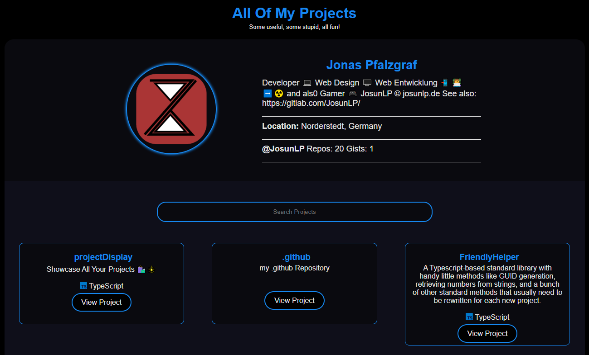
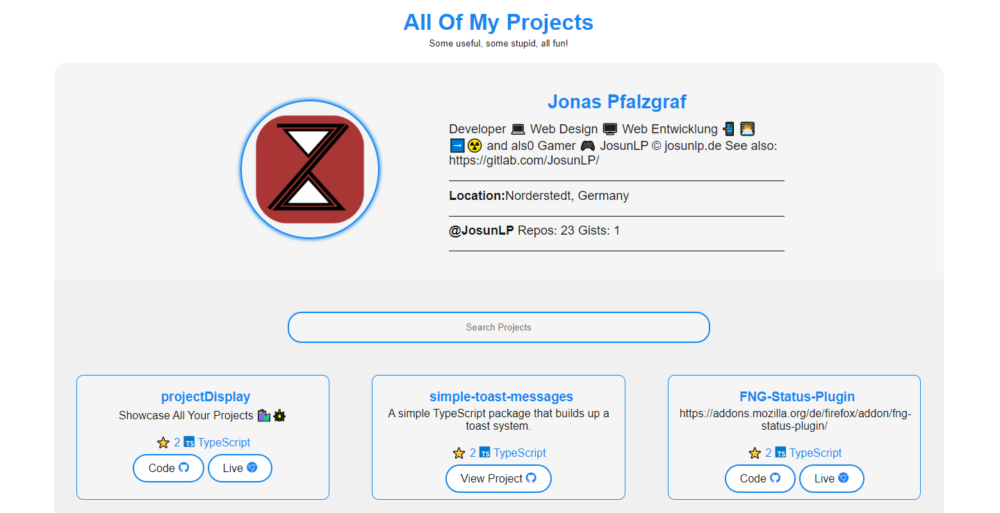

<div align = "center">

# Project Display

[](https://github.com/JosunLP/projectDisplay/blob/main/LICENSE)
[](https://github.com/JosunLP/projectDisplay/graphs/contributors)
[](https://github.com/JosunLP/projectDisplay/stargazers)
[](https://github.com/JosunLP/projectDisplay/network/members)
[](https://github.com/JosunLP/projectDisplay/watchers)
[](https://github.com/JosunLP/projectDisplay/issues)
[](https://github.com/JosunLP/projectDisplay/pulse)

<h3>Showcase All Your Projects 🛍️🎇</h3>

<figure>
  
  <br/>
  <figcaption>projects screenshot</figcaption>
</figure>

</div>

## Important

This Project is a Fork and rework of the original Project Display Project. The original can be found [here](https://github.com/2KAbhishek/projects).

## Introducing Projects

Present all your projects in style with a super customizable web app! ✨

`Projects` uses the GitHub API to list all your GitHub projects in a nice searchable grid.
Also shows pretty programming icons using `devicons`.

## Getting Projects

To get projects, follow these steps:

```bash
git clone https://github.com/JosunLP/projectDisplay
cd projectDisplay
```

### Setup Your Own Projects

You can easily set up projects to show your own repos.

- Fork the repo
- Clone it
- Open up `src/config/configuration.ts` and update the `username` variable in the `default_profile` object to your GitHub username.
- You may also want to update the favicon too, update the `link` tag in `index.html`
- Push your changes
- use `npm i && npm run deploy` to deploy your changes

Now you can host your projects on your own server or, if you prefere/ as github page.

#### Number Of Repos

The number of repos is controlled by the `maxPages` variable, the GitHub API supports 100 repos per page max.
If you have less than 100 repos, set `maxPages` to 1, if you have 300 then 3.

You can also edit the fetch query to reduce the per page repo count.

> There's no pagination, all repos are shown on the same page.

### Forked Repos

Forked repos are hidden by default, to show them set `default_profile.hideForks = false` in `configurtation.ts`

### Themes

Comes with a dark and light theme by default, depends upon your system configs.
Edit the variables under `:root` in `styles.css` to modify colorscheme.



### Programming Language Icons

This project uses [Devicon](https://devicon.dev/) for adding language icons, if the language name and icon are not being
displayed correctly for any of your repos, update `devicons` mapping in `src/constants/devicons.ts`.

## How it was built

Projects was built using `HTML` `SASS` & `TypeScript`.
It was built on with VsCode.
Uses GitHub API for data and Devicons for programming icons.

## More Info

<div align="center">

<a href="https://github.com/JosunLP/projectDisplay">Source</a> | <a href="https://josunlp.de/">Website</a>

</div>
