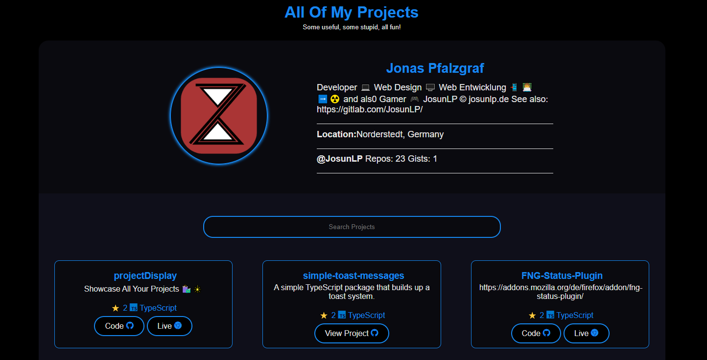

<div align = "center">

# Project Display

[](https://github.com/JosunLP/projectDisplay/blob/main/LICENSE)

[](https://github.com/JosunLP/projectDisplay/graphs/contributors)

[](https://github.com/JosunLP/projectDisplay/stargazers)

[](https://github.com/JosunLP/projectDisplay/network/members)

[](https://github.com/JosunLP/projectDisplay/watchers)

[](https://github.com/JosunLP/projectDisplay/issues)

[](https://github.com/JosunLP/projectDisplay/pulse)

<h3>Showcase All Your Projects 🛍️🎇</h3>

<figure>
  
  <br/>
  <figcaption>projects screenshot</figcaption>
</figure>

</div>

## Important

This Project is a Fork and rework of the original Project Display Project. The original can be found [here](https://github.com/2KAbhishek/projects).

## Introducing Projects

Present all your projects in style with a super customizable web app! ✨

`Projects` uses the GitHub API to list all your GitHub projects in a nice searchable grid.
Also shows pretty programming icons using `devicons`.

## Inspiration

Needed a way to display all my projects, used my [portfolio's project section](https://2kabhishek.github.io/#projects) as inspiration.

## Getting Projects

To get projects, follow these steps:

```bash
git clone https://github.com/JosunLP/projectDisplay
cd projects
```

### Setup Your Own Projects

You can easily set up projects to show your own repos.

- Fork the repo
- Clone it
- Open up `script.js` and update the `username` variable to your GitHub username.
- Open up `index.html` and update the `title` tag to make it your username.
- You may also want to update the favicon too, update the `link` tag in `index.html`
- Push your changes
- Go to repo settings on GitHub and enable GitHub Pages.

The site should be live on `https://<your-username>.github.io/projects`

Here's the projects page for [@sindresorhus](github.com/sindresorhus)


#### Number Of Repos

The number of repos is controlled by the `maxPages` variable, the GitHub API supports 100 repos per page max.
If you have less than 100 repos, set `maxPages` to 1, if you have 300 then 3.

You can also edit the fetch query to reduce the per page repo count.
> There's no pagination, all repos are shown on the same page.

#### Authenticated Requests

If you are working locally and notice the API is not sending over data, it might be because of rate limit on GitHub API requests.

You can either wait for an hour or setup a personal access token on GitHub and pass that into the fetch request in `script.js`

#### Programming Language Icons

This project uses [Devicon](https://devicon.dev/) for adding language icons, if the language name and icon are not being
displayed correctly for any of your repos, update `devicons` mapping in `script.js`.

## Viewing projects

Open `index.html` in your favorite browser or visit [2kabhishek.github.io/projects](https://2kabhishek.github.io/projects).

## How it was built

Projects was built using `HTML` `CSS` & `JavaScript`.
It was built on Neovim and the python http server.
Uses GitHub API for data and Devicons for programming icons.

## What I learned

- Learned about a few quirks of the fetch API, especially implementation of `maxPages`.
- Flex, box-shadow and some other CSS tricks were revisited.

## What's next

You tell me!

Hit the ⭐ button if you found this useful.

## More Info

<div align="center">

<a href="https://github.com/JosunLP/projectDisplay">Source</a> | <a href="https://projectDisplay.josunlp.de/">Website</a>

</div>
